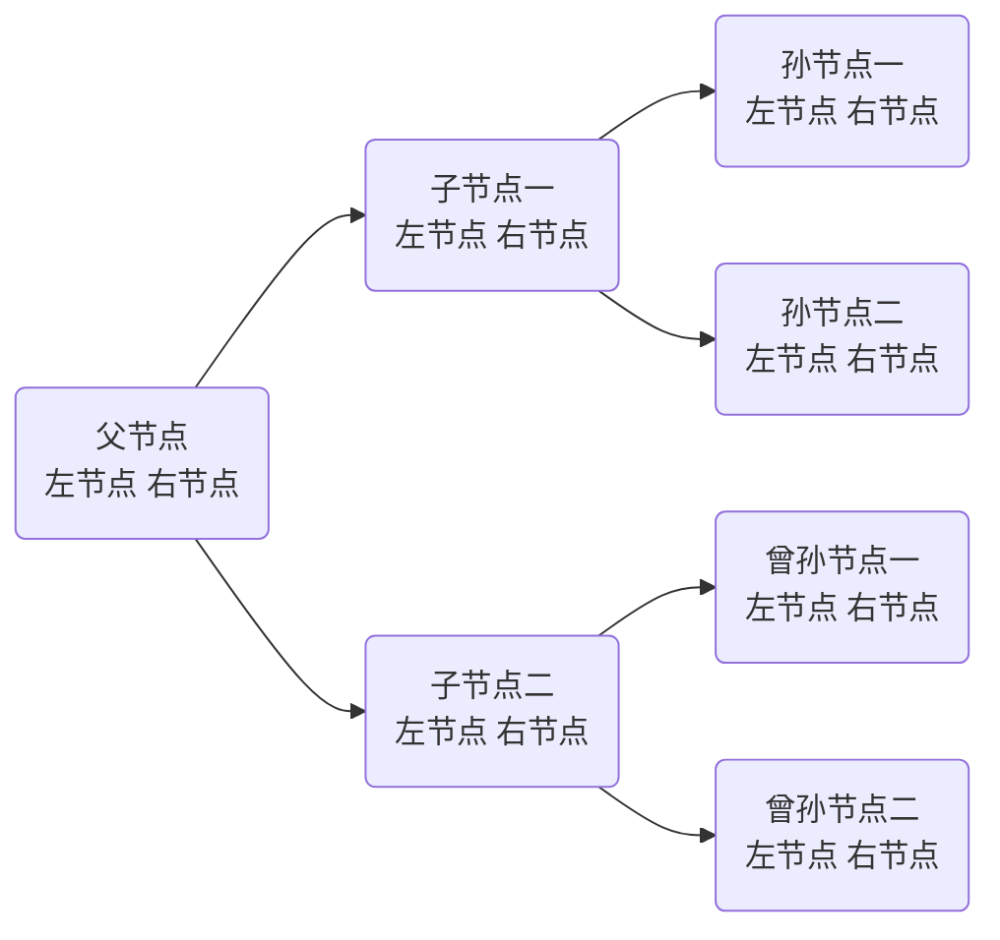

## 种一颗赛博柠檬树（二叉树数据结构的讲解）
### 为什么要使用二叉树结构？
二叉树是一种非常高效的数据结构，它具有以下几个优点，使得它在许多应用场景中非常有用：
1. **快速查找**：二叉搜索树（BST）可以快速查找一个特定的值。在最坏的情况下，查找操作的时间复杂度为O(n)，但在平均和最佳情况下，时间复杂度为O(log n)。这是因为BST的每个节点都有两个子节点，并且节点的值按照某种顺序排列，使得可以快速定位到目标值。
2. **有序性**：二叉树可以是有序的，这使得它们非常适合排序和查找。例如，二叉搜索树中的节点值是有序的，这使得我们可以使用中序遍历来获取有序的值序列。
3. **高效插入和删除**：二叉树结构使得插入和删除操作也非常高效。在最坏的情况下，插入和删除操作的时间复杂度为O(n)，但在平均和最佳情况下，时间复杂度为O(log n)。
4. **多用途**：二叉树可以用于实现多种数据结构，如平衡树（AVL树、红黑树等）、优先队列（堆）、并查集等。
5. **空间效率**：与数组相比，二叉树提供了更好的空间效率，因为它们不需要预先分配固定大小的内存空间。
6. **支持多种遍历方式**：二叉树支持前序遍历、中序遍历、后序遍历等多种遍历方式，这使得它们可以灵活地应用于不同的场景。
7. **优先队列**：二叉堆是一种特殊的二叉树，它可以作为优先队列使用，提供高效的插入和删除操作。
尽管二叉树具有许多优点，但也存在一些缺点，例如，在极端情况下，插入和删除操作的时间复杂度可能较高，以及二叉树通常需要额外的空间来存储指针。此外，维护二叉树（如平衡树）的平衡状态可能会增加额外的复杂性和计算成本。

### 什么是二叉树

像这样的一个树状结构，
<!--stackedit_data:
eyJoaXN0b3J5IjpbLTg5NzA5NjJdfQ==
-->