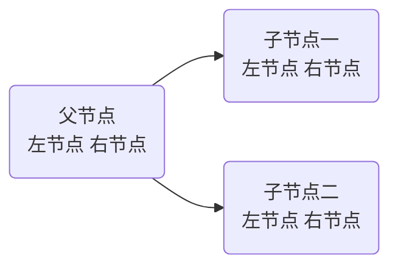

## 种一颗赛博柠檬树（二叉树数据结构的讲解）
### 什么是二叉树

```mermaid
graph LR
A(父节点<br>左节点 右节点) --> B(子节点一<br>左节点 右节点)
A --> C(子节点二<br>左节点 右节点)
```
像这样的一个树状结构，
<!--stackedit_data:
eyJoaXN0b3J5IjpbLTE4Njc3ODYwMjddfQ==
-->