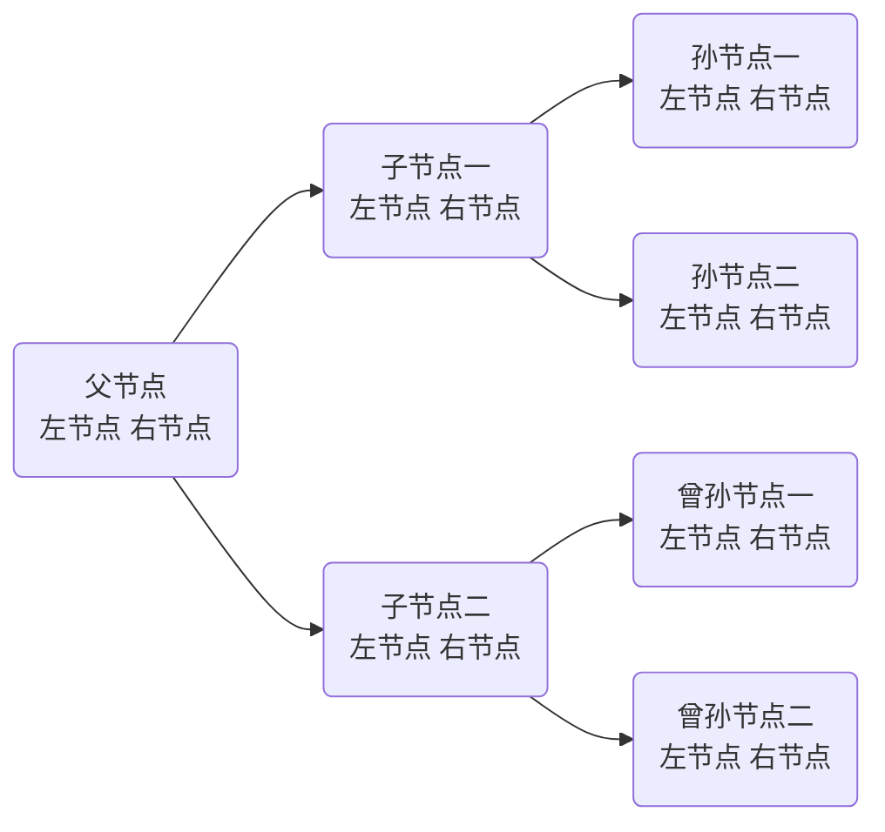

## 种一颗电子树（二叉树数据结构的讲解）
### 为什么要使用二叉树结构？
二叉树是一种非常高效的数据结构，它具有以下几个优点，使得它在许多应用场景中非常有用：
1. **快速查找**：二叉搜索树（BST）可以快速查找一个特定的值。在最坏的情况下，查找操作的时间复杂度为O(n)，但在平均和最佳情况下，时间复杂度为O(log n)。这是因为BST的每个节点都有两个子节点，并且节点的值按照某种顺序排列，使得可以快速定位到目标值。
2. **有序性**：二叉树可以是有序的，这使得它们非常适合排序和查找。例如，二叉搜索树中的节点值是有序的，这使得我们可以使用中序遍历来获取有序的值序列。
3. **高效插入和删除**：二叉树结构使得插入和删除操作也非常高效。在最坏的情况下，插入和删除操作的时间复杂度为O(n)，但在平均和最佳情况下，时间复杂度为O(log n)。
4. **多用途**：二叉树可以用于实现多种数据结构，如平衡树（AVL树、红黑树等）、优先队列（堆）、并查集等。
5. **空间效率**：与数组相比，二叉树提供了更好的空间效率，因为它们不需要预先分配固定大小的内存空间。
6. **支持多种遍历方式**：二叉树支持前序遍历、中序遍历、后序遍历等多种遍历方式，这使得它们可以灵活地应用于不同的场景。
7. **优先队列**：二叉堆是一种特殊的二叉树，它可以作为优先队列使用，提供高效的插入和删除操作。
尽管二叉树具有许多优点，但也存在一些缺点，例如，在极端情况下，插入和删除操作的时间复杂度可能较高，以及二叉树通常需要额外的空间来存储指针。此外，维护二叉树（如平衡树）的平衡状态可能会增加额外的复杂性和计算成本。

### 什么是二叉树

像这样的一个树状结构，由一个父节点开始，每一个父节点产生两个子节点，每一个子节点产生两个孙节点，如此往复，每一个节点中都存储着一个结构体信息，按照一定的规律对树结构内的信息进行访问并输出，对于左侧的节点，可以采用左侧结构体指针进行访问，同理，右侧的节点也可以使用右结构体指针进行访问。通过二叉树的这种特点，循环n次以后我们就得到了一个含有2^N个信息的树状结构。

### 怎么实现二叉树
可以看出，思路与之前文章讲到的链表结构相仿，大体就是next指针从一个变成了left和right两个指针，也说明了知识的进步是循序渐进的。
1. - [ ] 首先，创建二叉树所需的结构体。
```c
// 定义二叉树节点
typedef struct TreeNode {
    int value; // 节点的值
    struct TreeNode *left; // 指向左子节点的指针
    struct TreeNode *right; // 指向右子节点的指针
} TreeNode;
```
这里我们声明了这个结构体，它含有两个指针结构，分别对应以后的左节点和右节点，同时包含着一个属于自己的信息。

2. - [ ] 其次,我们开始对二叉树的新节点的创建
```c
// 创建新节点
TreeNode* createNode(int value) {
    TreeNode* newNode = (TreeNode*)malloc(sizeof(TreeNode)); // 分配新节点的内存
    if (newNode == NULL) { // 检查内存分配是否成功
        printf("内存分配失败\n");
        exit(1); // 如果分配失败，则退出程序
    }
    newNode->value = value; // 设置新节点的值
    newNode->left = newNode->right = NULL; // 初始化新节点的左右子节点为空
    return newNode; // 返回新创建的节点指针
}
```
3. - [ ] 节点的插入
```c
// 插入节点
void insert(TreeNode** root, int value) {
    if (*root == NULL) { // 如果根节点为空，则创建新节点作为根节点
        *root = createNode(value);
        return;
    }
    TreeNode* current = *root; // 当前节点初始指向根节点
    TreeNode* parent = NULL; // 父节点初始为空
    while (current != NULL) { // 循环查找插入位置
        parent = current; // 记录当前节点为父节点
        if (value < current->value) { // 如果要插入的值小于当前节点的值
            current = current->left; // 移动到左子节点
        } else { // 如果要插入的值大于当前节点的值
            current = current->right; // 移动到右子节点
        }
    }
    if (value < parent->value) { // 如果要插入的值小于父节点的值
        parent->left = createNode(value); // 在父节点的左子节点位置创建新节点
    } else { // 如果要插入的值大于父节点的值
        parent->right = createNode(value); // 在父节点的右子节点位置创建新节点
    }
}
```
4. - [ ] 二叉树的打印
// 打印二叉树
void printTree(TreeNode* root) {
    if (root == NULL) { // 如果根节点为空，则返回
        return;
    }
    printTree(root->left); // 递归打印左子树
    printf("%d ", root->value); // 打印当前节点的值
    printTree(root->right); // 递归打印右子树
}
```
5. - [ ] 
<!--stackedit_data:
eyJoaXN0b3J5IjpbNjM5NjA0NDUxLC0xMzg4ODQ4MjkwXX0=
-->