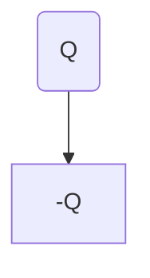

### 电偶极子
两个大小相等符号相反的点电荷，之间的距离为l,两点连线为电偶极子轴线，取复到正为正方向，电荷量q与l乘积为电偶极矩，简称电矩，为矢量。

结论：电偶极子的场强不取决于q而是取决于p，这表明电偶极矩是表征电偶极子属性的一个重要物理量，而且当距离很大时，电偶极子的场强以r^3衰减，比点电荷的场强衰减快得多。
### 无限长均匀带电直线的场强

### 带电圆环
轴线上一点场强：

### 带电源盘

### 电荷连续分布场强计算

### 电场线
电场线的密集程度代表场强的强度，切线代表该点的场强方向。不会有交点，不闭合，起始于正电荷终止于无穷远处或负电荷。
### 电场线分布
**等量同种点电荷**：中点场强为0，中点附近电场线稀疏，
<!--stackedit_data:
eyJoaXN0b3J5IjpbMjYwMTM0MjgyLDU4Mzk5MDQ4OCwyNDMwNj
MzNzldfQ==
-->