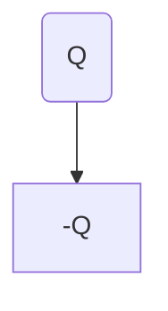

### 电偶极子
两个大小相等符号相反的点电荷，之间的距离为l,两点连线为电偶极子轴线，取复到正为正方向，电荷量q与l乘积为电偶极矩，简称电矩，为矢量。

```mermaid
	graph TD
    A(  Q  ) --> B[ -Q ]
```
### 

<!--stackedit_data:
eyJoaXN0b3J5IjpbLTEyMDc4MTM2NzAsMjQzMDYzMzc5XX0=
-->