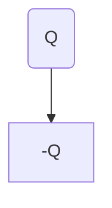

### 电偶极子
两个大小相等符号相反的点电荷，之间的距离为l,两点连线为电偶极子轴线，取复到正为正方向，电荷量q与l乘积为电偶极矩，简称电矩，为矢量。

结论：电偶极子的场强不取决于q而是取决于p，这表明电偶极矩是表征电偶极子属性的一个重要物理量，而且当距离很大时，电偶极子的场强以r^3衰减，比点电荷的场强衰减快得多。

<!--stackedit_data:
eyJoaXN0b3J5IjpbNzA0MTAyNDU3LDI0MzA2MzM3OV19
-->