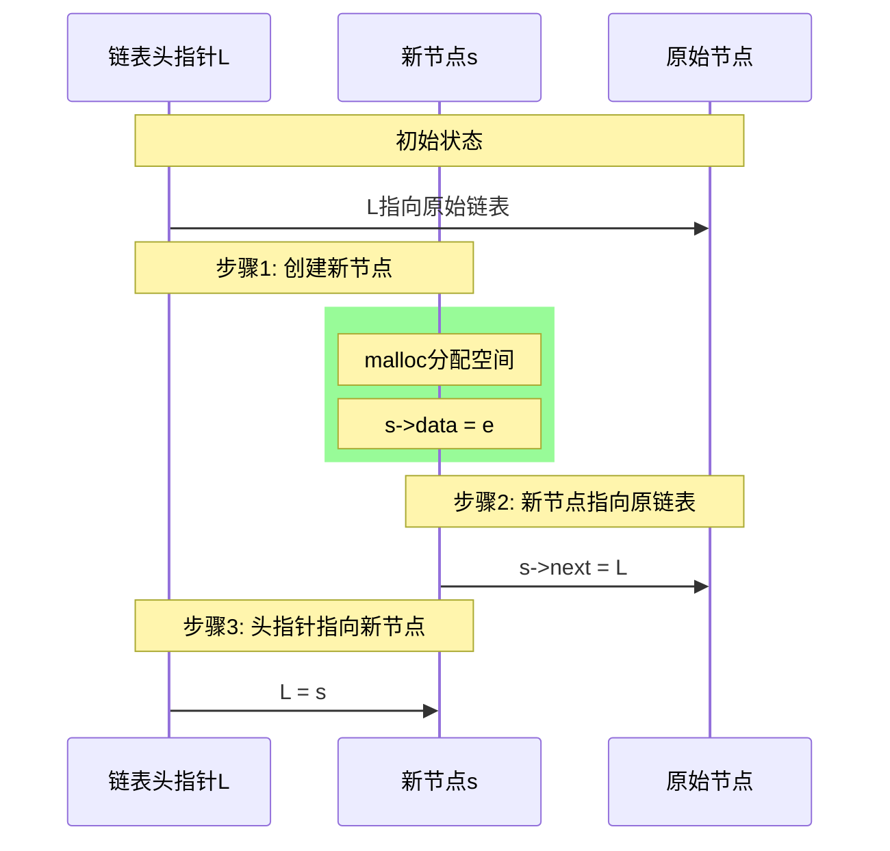
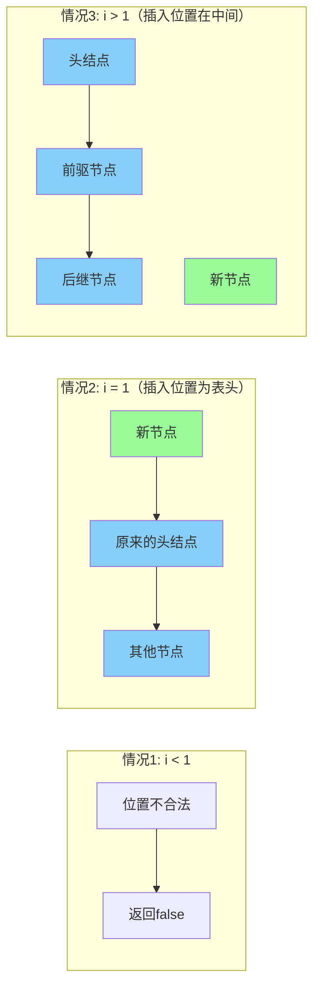
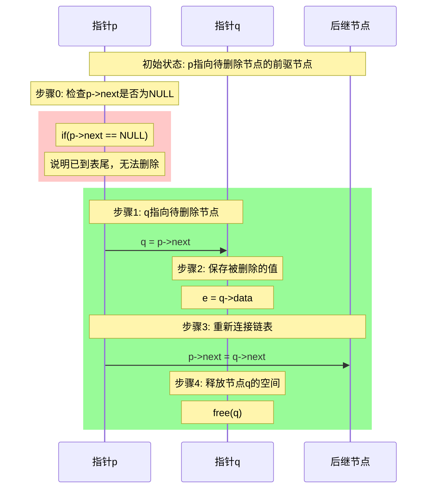

```mermaid
sequenceDiagram
    participant L as 链表头指针L
    participant S as 新节点s
    participant O as 原始节点

    Note over L,O: 初始状态
    L->>O: L指向原始链表
    
    Note over L,S: 步骤1: 创建新节点
    rect rgb(152, 251, 152)
    Note over S: malloc分配空间
    Note over S: s->data = e
    end
    
    Note over S,O: 步骤2: 新节点指向原链表
    S->>O: s->next = L
    
    Note over L,S: 步骤3: 头指针指向新节点
    L->>S: L = s
```

```mermaid
graph LR
    subgraph "情况1: i < 1"
        A1[位置不合法] --> B1[返回false]
    end

    subgraph "情况2: i = 1（插入位置为表头）"
        A2[新节点] --> B2[原来的头结点]
        B2 --> C2[其他节点]
        style A2 fill:#98FB98
        style B2 fill:#87CEFA
        style C2 fill:#87CEFA
    end

    subgraph "情况3: i > 1（插入位置在中间）"
        A3[头结点] --> B3[前驱节点] 
        B3 --> C3[后继节点]
        D3[新节点]
        style A3 fill:#87CEFA
        style B3 fill:#87CEFA
        style C3 fill:#87CEFA
        style D3 fill:#98FB98
    end
```

```mermaid
sequenceDiagram
    participant P as 指针p
    participant Q as 指针q
    participant N as 后继节点
    
    Note over P,N: 初始状态: p指向待删除节点的前驱节点
    
    Note over P: 步骤0: 检查p->next是否为NULL
    rect rgb(255, 200, 200)
    Note over P: if(p->next == NULL)
    Note over P: 说明已到表尾，无法删除
    end
    
    rect rgb(152, 251, 152)
    Note over P,Q: 步骤1: q指向待删除节点
    P->>Q: q = p->next
    
    Note over Q: 步骤2: 保存被删除的值
    Note over Q: e = q->data
    
    Note over P,N: 步骤3: 重新连接链表
    P->>N: p->next = q->next
    
    Note over Q: 步骤4: 释放节点q的空间
    Note over Q: free(q)
    end
```
<!--stackedit_data:
eyJoaXN0b3J5IjpbLTY1NDk5MDM5OCwtMjA4ODc0NjYxMl19
-->