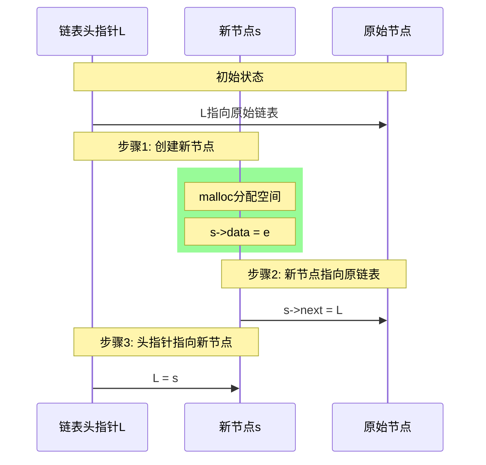
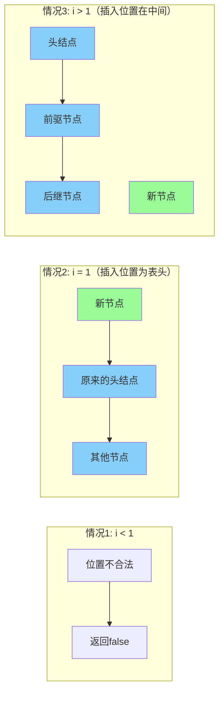

```mermaid
sequenceDiagram
    participant H as 头结点
    participant P as p节点
    participant Q as q节点(待删除)
    participant N as 后继节点

    Note over H,N: 初始状态
    H->>P: p是第i-1个节点
    P->>Q: p->next指向待删除节点
    Q->>N: q->next指向后继节点
    
    Note over P,Q: 步骤1: 检查p->next
    rect rgb(255, 182, 193)
    Note over P: if(p->next == NULL)
    Note over P: 说明没有可删除的节点
    end
    
    Note over P,Q: 步骤2: 保存待删除节点
    rect rgb(152, 251, 152)
    P->>Q: q = p->next
    Note over Q: e = q->data
    end
    
    Note over P,N: 步骤3: 重新连接
    rect rgb(135, 206, 250)
    P->>N: p->next = q->next
    end
    
    Note over Q: 步骤4: 释放空间
    rect rgb(255, 218, 185)
    Note over Q: free(q)
```





<!--stackedit_data:
eyJoaXN0b3J5IjpbLTg0ODk3ODQxMSwtMjA4ODc0NjYxMl19
-->