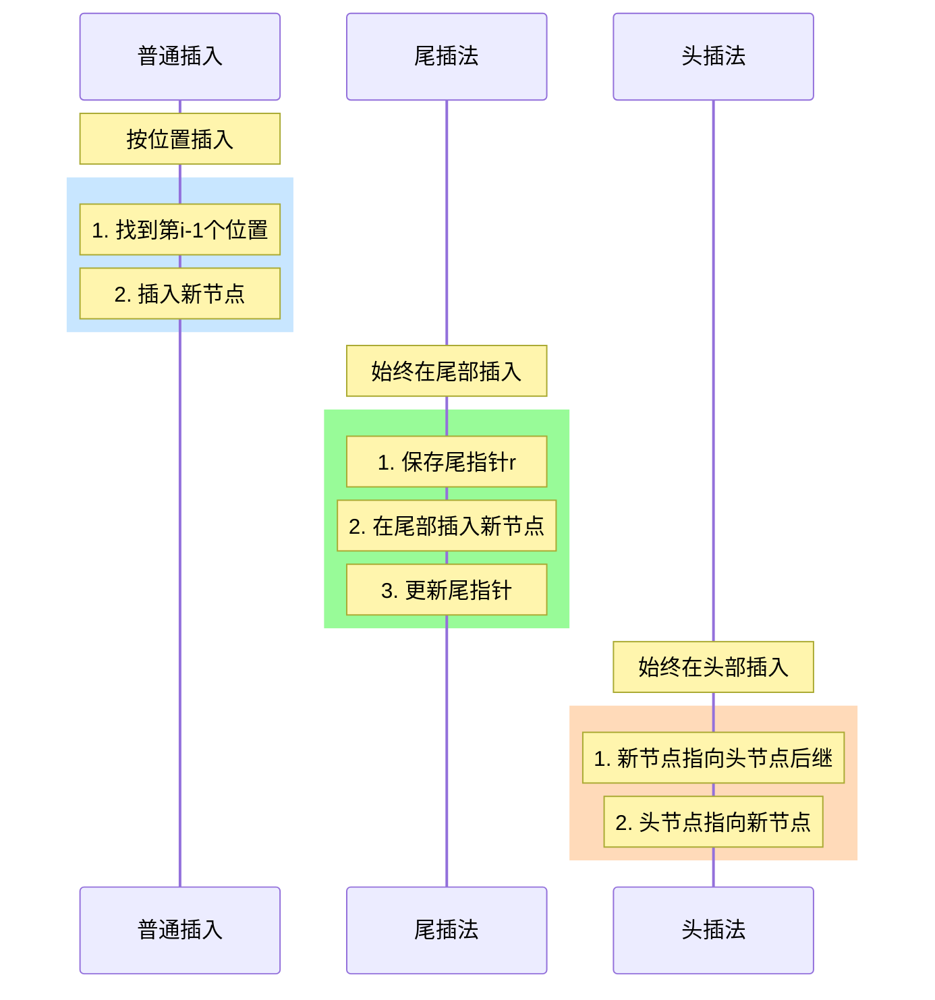
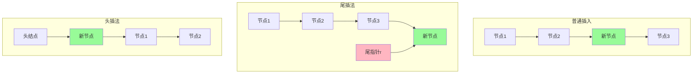

我来帮你详细对比这三种插入方法的区别。



让我们详细分析三种方法的特点：

1. 普通插入（按位置插入）：
```c
bool ListInsert(LinkList &L, int i, ElemType e){
    if(i < 1) return false;
    LNode *p = L;    // 从头节点开始
    int j = 0;
    while(p != NULL && j < i-1){  // 找到第i-1个位置
        p = p->next;
        j++;
    }
    if(p == NULL) return false;
    LNode *s = (LNode*)malloc(sizeof(LNode));
    s->data = e;
    s->next = p->next;
    p->next = s;
    return true;
}
```

2. 尾插法：
```c
LinkList List_TailInsert(LinkList &L){
    L = (LNode*)malloc(sizeof(LNode));  // 创建头结点
    L->next = NULL;
    LNode *r = L;    // r始终指向最后一个节点
    ElemType x;
    scanf("%d", &x);
    while(x != 9999){  // 输入9999表示结束
        LNode *s = (LNode*)malloc(sizeof(LNode));
        s->data = x;
        r->next = s;  // 新节点插入到r之后
        r = s;        // r指向新的尾节点
        scanf("%d", &x);
    }
    r->next = NULL;   // 尾节点指针置空
    return L;
}
```

3. 头插法：
```c
LinkList List_HeadInsert(LinkList &L){
    L = (LNode*)malloc(sizeof(LNode));  // 创建头结点
    L->next = NULL;
    ElemType x;
    scanf("%d", &x);
    while(x != 9999){  // 输入9999表示结束
        LNode *s = (LNode*)malloc(sizeof(LNode));
        s->data = x;
        s->next = L->next;  // 新节点指向原第一个节点
        L->next = s;        // 头节点指向新节点
        scanf("%d", &x);
    }
    return L;
}
```



主要区别：

1. 插入位置：
   - 普通插入：可以在任意位置插入
   - 尾插法：只在链表尾部插入
   - 头插法：只在链表头部插入

2. 效率比较：
   - 普通插入：需要遍历找到插入位置，时间复杂度O(n)
   - 尾插法：使用尾指针直接插入，时间复杂度O(1)
   - 头插法：直接在头部插入，时间复杂度O(1)

3. 使用场景：
   - 普通插入：适用于需要在特定位置插入节点的情况
   - 尾插法：适用于顺序创建链表，保持元素原有顺序
   - 头插法：适用于顺序创建链表，会使元素顺序反转

4. 特点：
   - 普通插入：灵活性最高，但效率相对较低
   - 尾插法：保持元素输入顺序，需要额外的尾指针
   - 头插法：元素顺序会反转，但实现最简单

实际应用建议：
1. 如果需要保持元素的输入顺序，使用尾插法
2. 如果不关心元素顺序或需要反转，使用头插法
3. 如果需要在特定位置插入，使用普通插入

特别注意：
- 尾插法中要维护尾指针
- 头插法会导致元素顺序反转
- 普通插入要注意位置的合法性检查
<!--stackedit_data:
eyJoaXN0b3J5IjpbMzc5Nzg3ODE3XX0=
-->