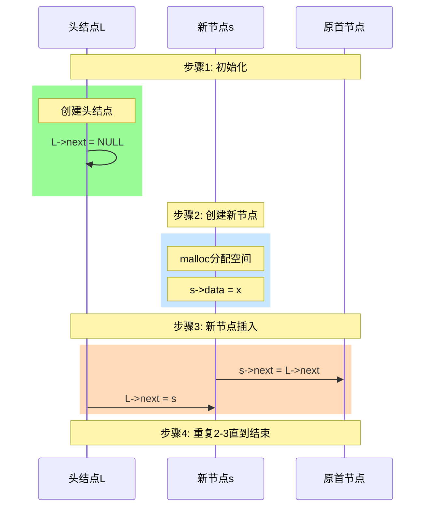
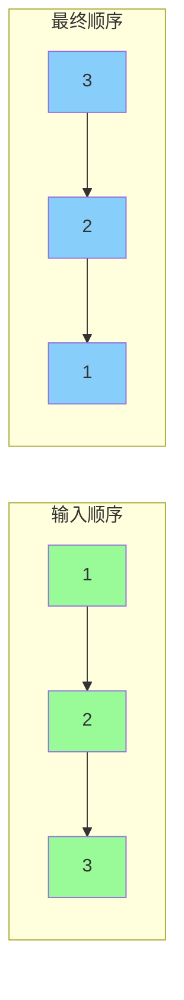

让我详细讲解头插法的实现过程。



代码实现和详细分析：

```c
LinkList List_HeadInsert(LinkList &L){
    // 1. 初始化
    L = (LNode*)malloc(sizeof(LNode));  // 创建头结点
    L->next = NULL;   // 初始时置空
    
    // 2. 循环插入数据
    ElemType x;
    scanf("%d", &x);  // 输入节点数据
    while(x != 9999){ // 输入9999表示结束
        // 2.1 创建新节点
        LNode *s = (LNode*)malloc(sizeof(LNode));
        s->data = x;
        
        // 2.2 插入新节点到表头
        s->next = L->next;  // 新节点指向原首节点
        L->next = s;        // 头结点指向新节点
        
        // 2.3 继续输入下一个数据
        scanf("%d", &x);
    }
    return L;
}
```

让我们通过图解来看看具体的插入过程：

```mermaid
graph TD
    subgraph "步骤1: 初始化"
        A1[头结点L] --> B1[NULL]
        style A1 fill:#FFB6C1
    end

    subgraph "步骤2: 插入第一个节点3"
        A2[头结点L] --> C2[3] --> B2[NULL]
        style A2 fill:#FFB6C1
        style C2 fill:#98FB98
    end

    subgraph "步骤3: 插入第二个节点2"
        A3[头结点L] --> D3[2] --> C3[3] --> B3[NULL]
        style A3 fill:#FFB6C1
        style D3 fill:#98FB98
        style C3 fill:#87CEFA
    end

    subgraph "步骤4: 插入第三个节点1"
        A4[头结点L] --> E4[1] --> D4[2] --> C4[3] --> B4[NULL]
        style A4 fill:#FFB6C1
        style E4 fill:#98FB98
        style D4 fill:#87CEFA
        style C4 fill:#87CEFA
    end

```



头插法的特点分析：

1. 实现原理：
   - 每次都在头结点之后插入新节点
   - 新节点的next指向原来的第一个节点
   - 头结点的next指向新节点

2. 插入步骤：
   - malloc创建新节点
   - 新节点的next指向头结点的next
   - 头结点的next指向新节点

3. 特点：
   - 时间复杂度O(1)
   - 最后得到的链表与输入顺序相反
   - 不需要尾指针



应用场景：
1. 需要逆置链表时
2. 不关心元素顺序时
3. 需要快速插入时

优点：
1. 实现简单
2. 插入效率高
3. 空间效率高，不需要额外指针

缺点：
1. 会改变元素的顺序
2. 不适合要求保持原顺序的场景

使用建议：
1. 如果不在意顺序，优先使用头插法
2. 如果需要逆置链表，可以先用头插法创建
3. 注意检查内存分配是否成功

需要注意：
1. 插入顺序与最终顺序相反
2. 每次都要修改两个指针
3. 要检查内存分配
4. 记得初始化头结点

相比尾插法：
1. 不需要维护尾指针
2. 实现更简单
3. 但会改变元素顺序
<!--stackedit_data:
eyJoaXN0b3J5IjpbLTExNTUxNTEwMDNdfQ==
-->