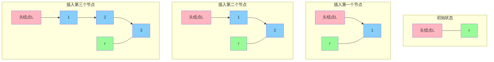

让我详细讲解尾插法的实现过程和原理。

```mermaid
sequenceDiagram
    participant L as 头指针L
    participant R as 尾指针r
    participant N as 新节点s
    
    Note over L,R: 步骤1: 初始化
    rect rgb(152, 251, 152)
    L->>L: 创建头结点
    L->>R: r = L (尾指针初始指向头结点)
    end
    
    Note over L,R,N: 步骤2: 循环插入过程
    rect rgb(200, 230, 255)
    Note over N: malloc创建新节点s
    Note over N: s->data = x
    R->>N: r->next = s
    N->>R: r = s
    end
    
    Note over R: 步骤3: 收尾工作
    rect rgb(255, 218, 185)
    R->>R: r->next = NULL
    end
```

让我们通过代码和详细解释来理解尾插法：

```c
LinkList List_TailInsert(LinkList &L){
    // 1. 创建头结点
    L = (LNode*)malloc(sizeof(LNode));
    L->next = NULL;
    
    // 2. 尾指针r初始化指向头结点
    LNode *r = L;
    
    // 3. 循环读入数据
    ElemType x;
    scanf("%d", &x);
    while(x != 9999){  // 输入9999表示结束
        // 3.1 创建新节点
        LNode *s = (LNode*)malloc(sizeof(LNode));
        s->data = x;
        
        // 3.2 新节点插入到r之后
        r->next = s;
        
        // 3.3 r指向新的尾节点
        r = s;
        
        // 3.4 读入下一个数据
        scanf("%d", &x);
    }
    
    // 4. 尾节点指针置空
    r->next = NULL;
    return L;
}
```

让我们看看链表的动态变化过程：



关键步骤解析：

1. 初始化阶段：
   - 创建头结点L
   - 尾指针r初始指向头结点
   - 此时链表为空

2. 插入过程：
   - 创建新节点s
   - 将新节点链接到尾部：r->next = s
   - 更新尾指针：r = s
   - 重复此过程直到输入结束

3. 特点和优势：
   - 始终保持r指向最后一个节点
   - 插入操作时间复杂度为O(1)
   - 保持元素的输入顺序
   - 不需要遍历链表

4. 注意事项：
   - 记得维护尾指针r
   - 最后要将尾节点的next置为NULL
   - 要处理输入结束的情况

使用示例：
```c
int main(){
    LinkList L;
    printf("请输入数据（9999结束）：");
    List_TailInsert(L);  // 例如输入：1 2 3 9999
    // 结果将创建一个包含1->2->3的链表
    return 0;
}
```

实际应用建议：
1. 尾插法适合顺序创建链表
2. 当需要保持元素的输入顺序时使用
3. 相比头插法，不会导致元素顺序反转
4. 适合大量数据的连续插入操作

总结：
尾插法是一种高效的链表创建方法，通过维护尾指针，实现了O(1)时间复杂度的插入操作，同时保持了元素的输入顺序。这使它特别适合于顺序创建链表的场景。
<!--stackedit_data:
eyJoaXN0b3J5IjpbLTkwNjQ3MTEyOF19
-->