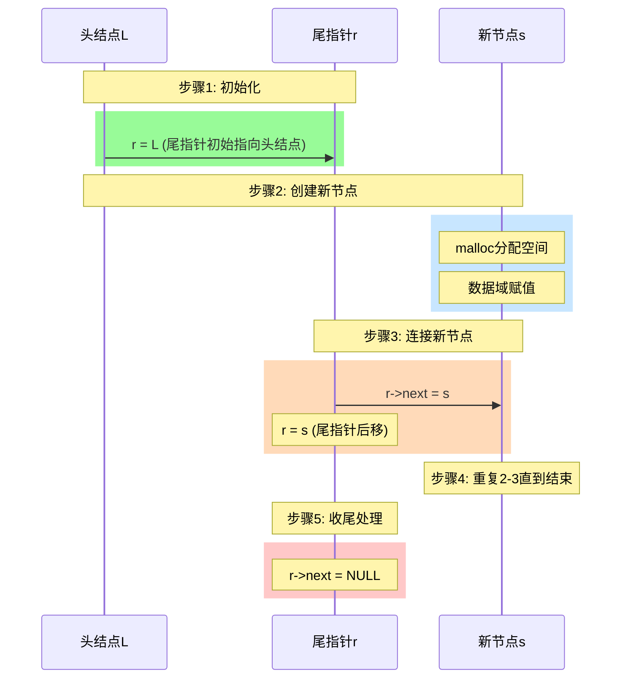

让我为你详细讲解尾插法的实现过程。



让我们看看代码实现并详细分析每一步：

```c
LinkList List_TailInsert(LinkList &L){
    // 1. 初始化
    L = (LNode*)malloc(sizeof(LNode));  // 创建头结点
    L->next = NULL;
    LNode *r = L;    // r指针指向尾节点，初始时指向头结点
    
    // 2. 循环插入数据
    ElemType x;
    scanf("%d", &x);  // 输入节点数据
    while(x != 9999){ // 输入9999表示结束
        // 2.1 创建新节点
        LNode *s = (LNode*)malloc(sizeof(LNode));
        s->data = x;
        s->next = NULL;
        
        // 2.2 插入新节点
        r->next = s;  // 新节点连到尾部
        r = s;        // r指向新的尾节点
        
        // 2.3 继续输入下一个数据
        scanf("%d", &x);
    }
    
    // 3. 尾节点指针置空
    r->next = NULL;
    return L;
}
```

让我们通过图解来看看整个过程是如何进行的：

```mermaid
graph TD
    subgraph "步骤1: 初始化"
        A1[头结点L] 
        B1[r]
        A1 --- B1
        style A1 fill:#FFB6C1
        style B1 fill:#98FB98
    end

    subgraph "步骤2: 插入第一个节点"
        A2[头结点L] --> C2[新节点1]
        D2[r]
        C2 --- D2
        style A2 fill:#FFB6C1
        style C2 fill:#87CEFA
        style D2 fill:#98FB98
    end

    subgraph "步骤3: 插入第二个节点"
        A3[头结点L] --> C3[节点1] --> E3[新节点2]
        F3[r]
        E3 --- F3
        style A3 fill:#FFB6C1
        style C3 fill:#87CEFA
        style E3 fill:#87CEFA
        style F3 fill:#98FB98
    end

    subgraph "步骤4: 完成插入"
        A4[头结点L] --> C4[节点1] --> E4[节点2] --> G4[NULL]
        style A4 fill:#FFB6C1
        style C4 fill:#87CEFA
        style E4 fill:#87CEFA
    end

```



关键点解析：

1. 尾指针r的作用：
   - 始终指向链表的最后一个节点
   - 避免每次插入都要遍历到链表尾部
   - 使得插入操作的时间复杂度为O(1)

2. 初始化过程：
   - 创建头结点L并分配空间
   - 初始时r指向头结点
   - 头结点的next指针置为NULL

3. 插入过程：
   - 创建新节点s并分配空间
   - 将数据存入新节点
   - 通过r->next = s连接新节点
   - 更新r = s，保持r始终指向最后节点

4. 结束处理：
   - 最后一个节点的next指针置为NULL
   - 返回创建好的链表

优点：
1. 插入效率高，时间复杂度O(1)
2. 保持数据的输入顺序
3. 实现简单直观

使用建议：
1. 适合顺序创建链表
2. 适合需要保持数据原有顺序的场景
3. 大量数据插入时效率高

需要注意：
1. 要正确维护尾指针r
2. 注意内存分配是否成功
3. 记得处理最后一个节点的next指针
<!--stackedit_data:
eyJoaXN0b3J5IjpbLTE2MzA1NjIwMjNdfQ==
-->