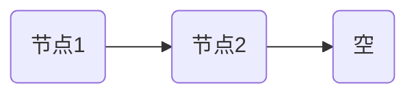
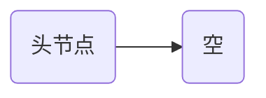
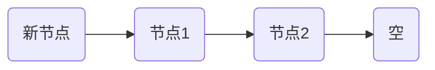

在带头单链表和不带头单链表中，头节点的存在与否会对链表的操作产生一定的影响。我们可以通过用 `mermaid` 图表来可视化这两个不同类型的链表在插入、初始化、以及判空操作中的区别。

### 1. 带头单链表与不带头单链表

- **带头单链表**：有一个特殊的头节点，不存储数据，主要用于方便链表操作。
- **不带头单链表**：没有额外的头节点，链表的第一个节点就是存储数据的节点。

#### 带头单链表结构

#### 不带头单链表结构

### 2. 初始化

#### 带头单链表初始化
- 初始化时，链表至少包含一个头节点，头节点指向空。

#### 不带头单链表初始化
- 初始化时，链表为空，直接指向空。

### 3. 判空操作

#### 带头单链表判空
- 判空时，只需检查头节点的指针是否指向空。

#### 不带头单链表判空
- 判空时，只需检查链表的第一个节点是否为 `Null`。

### 4. 插入操作

#### 带头单链表的插入
- 插入时，不论是头部还是中间，操作较为统一，因为有头节点的存在。插入到第一个元素之前时，不需要特殊处理。

#### 不带头单链表的插入
- 如果插入到链表第一个位置，需要特别处理，因为需要改变整个链表的头指针。

### 总结
- **带头单链表**因为有了头节点，很多操作更为方便，尤其是在插入第一个节点或判空时，不需要特殊判断。
- **不带头单链表**则相对更轻量，但在执行插入或判空等操作时需要额外处理第一个节点的特殊情况。
<!--stackedit_data:
eyJoaXN0b3J5IjpbLTE2ODM0MDk3NTddfQ==
-->