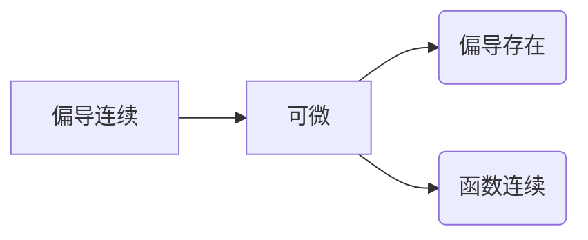

 - [ ] 判断函数在某点处的连续性，本质是求极限判断函数值是否相等
 - [ ] 求函数极限，定义法，夹逼定理，洛必达法则，直接代入，极小值代换，换元法，不等式代换
 - [ ] 判断函数某点是否可微，是否有偏导数，可微：不连续，无偏导数一定不可微，连续根据定义判断，偏导连续可推可微

- [ ] 隐函数求导
- [ ] 多元复合函数求导
- [ ] 求微分dz求偏导数偏z
- [ ] 拉格朗日啥玩意方程，
<!--stackedit_data:
eyJoaXN0b3J5IjpbNTQ3MTM2OTUyXX0=
-->