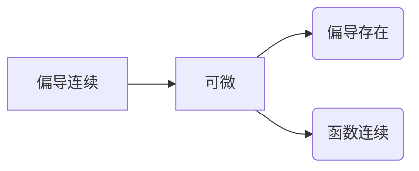

 - [ ] 判断函数在某点处的连续性，本质是求极限判断函数值是否相等
 - [ ] 求函数极限，定义法，夹逼定理，洛必达法则，直接代入，极小值代换，换元法，不等式代换
 - [ ] 判断函数某点是否可微，是否有偏导数，可微：不连续，无偏导数一定不可微，连续根据定义判断，偏导连续可推可微

- [ ] 隐函数求导
- [ ] 多元复合函数求导
- [ ] 求微分dz求偏导数偏z
- [ ] 拉格朗日乘数法 构造辅助函数f(x,y,z) = f(x,y) + z&(x,y)求出z,x,y，则(x,y)为对应&条件下可能的极值点。
- [ ] 方向余弦，求距离，算三角形面积，叉积，点乘，混合积
<!--stackedit_data:
eyJoaXN0b3J5IjpbNzYzMTM1NDJdfQ==
-->